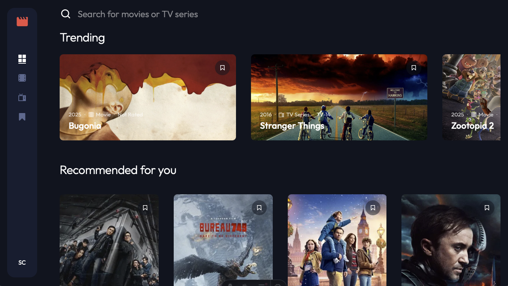
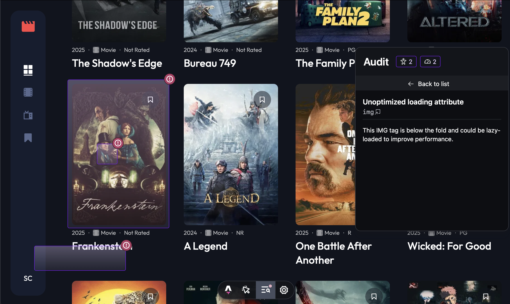

# Frontend Mentor - Entertainment Web App Solution

This is a solution to the [Entertainment web app challenge on Frontend Mentor](https://www.frontendmentor.io/challenges/entertainment-web-app-J-UhgAW1X). Frontend Mentor challenges help you improve your coding skills by building realistic projects.

## Table of Contents

- [Overview](#overview)
  - [The Challenge](#the-challenge)
  - [Screenshot](#screenshot)
  - [Links](#links)
- [My Process](#my-process)
  - [Built With](#built-with)
  - [Why Server-Side Rendering?](#why-server-side-rendering)
  - [What I Learned](#what-i-learned)
  - [Continued Development](#continued-development)
  - [Useful Resources](#useful-resources)
- [Author](#author)

## Overview

### The Challenge

Users should be able to:

- View the optimal layout for the app depending on their device's screen size
- See hover states for all interactive elements on the page
- Navigate between Home, Movies, TV Series, and Bookmarked Shows pages
- Add/remove bookmarks from all movies and TV series
- Search for relevant shows on all pages
- **Bonus**: Build this project as a full-stack application
- **Bonus**: If you're building a full-stack app, we provide authentication screen (sign-up/login) designs if you'd like to create an auth flow

### Screenshot



### Links

- Solution URL: [https://github.com/Chious/fm-entertainment-web-app](https://github.com/Chious/fm-entertainment-web-app)
- Live Site URL: [https://fm-entertainment-web-app.vercel.app](https://fm-entertainment-web-app.vercel.app)

## My Process

### Built With

**Tech Stack**

- Astro
- Drizzle ORM
- Turso (libSQL database)
- Better Auth (as recommended by Astro, for authentication flow)
- Vercel (deployment)

### Why Server-Side Rendering?

When I first approached this project, platforms like [Repove](https://repov.me/) and [Threads](https://www.threads.com) came to mind. Rather than building a closed-source SaaS, I wanted users to be able to share their thoughts on posts similar to [Reddit](https://www.reddit.com/r/movies/comments/1b44icg/can_someone_explain_to_me_everything_everywhere/) (great movie, by the way!). I decided to make most of the data available from the TMDB API.

Furthermore, I wanted to explore Astro's capabilities and limitations, so I implemented data fetching, image optimization, and authentication flow for this project.

### What I Learned

**Asset Optimization & SEO**

When it comes to hydration and asset optimization, Astro's developer experience is superior to Next.js. There are audit reports during the development process:

```plaintext
This IMG tag is below the fold and could be lazy-loaded to improve performance.
```



I addressed these by adding `loading`, `format`, and `fetchPriority` attributes in components:

```jsx
<Image
  src={thumbnailUrl}
  alt={title}
  loading="eager"
  fetchpriority="high"
  inferSize={true}
/>
```

Data fetching in Astro is also more intuitive:

```astro
---
// Server-side code only triggers once while first rendering
const data = fetch("example.api.domain.com")
---

{
  data.map(dt => {
    <Card data={dt}/>
  })
}
```

In my first attempts with Next.js, I would mistakenly use client-side methods:

(take a look for [data fetching](https://nextjs.org/docs/app/getting-started/fetching-data))

```jsx
"use client"

const fetchData = async () => {
  fetch("example.api.domain.com")
}

useEffect(() => {
  const dt = await fetchData()
  setData(dt)
}, [])
```

However, for more complex applications—especially those with intricate authentication flows or complex state interactions—Next.js is more convenient (compared with CMS blog). Its ecosystem offers more complete libraries for handling server state:

- Server state: React Query -- [React Example: Nextjs](https://tanstack.com/query/latest/docs/framework/react/examples/nextjs)
- Authentication: NextAuth, etc.

Astro relies more heavily on third-party packages, and there can be some challenges with AstroDB.

**SEO Validation**

Beyond relying on DevTools audit, I also checked Lighthouse scores and used F12 > View Page Source to verify SSR implementation.

For this [React + Vite](https://rtk-query-practice.vercel.app) project, the source code looks like:

```html
<!DOCTYPE html>
<html lang="en">
  <head>
    <meta charset="UTF-8" />
    <link rel="icon" type="image/svg+xml" href="/vite.svg" />
    <meta name="viewport" content="width=device-width, initial-scale=1.0" />
    <title>Vite + React + TS</title>
    <script type="module" crossorigin src="/assets/index-DppYopoN.js"></script>
    <link rel="stylesheet" crossorigin href="/assets/index-n_ryQ3BS.css" />
  </head>
  <body>
    <div id="root"></div>
  </body>
</html>
```

Astro hydrates HTML by default:

```html
<!DOCTYPE html>
<html lang="en">
  <head>
    <meta charset="UTF-8" />
    <meta name="viewport" content="width=device-width" />
    <link rel="icon" type="image/svg+xml" href="/favicon.svg" />
    <meta name="generator" content="Astro v5.16.0" />
    <title>Home - Entertainment Web App</title>
    <!-- Additional meta tags and scripts -->
  </head>
  <body class="m-0 w-full min-h-screen">
    <!-- Hydrated content here -->
  </body>
</html>
```

### Continued Development

> There are still some issues, but time is precious—it's time to move forward.

⚠️ **Known Issues**

1. **State Mismatch**: For `bookmark` and `auth`, the state is correct on the server side, but users need to reload the page to see the correct result.

2. **Future Plans**: Implement movie introductions and add media sharing or diary features.

### Useful Resources

**Core Framework & Tools**

- [Astro Documentation](https://docs.astro.build/) - Official Astro documentation
- [Astro Integrations](https://docs.astro.build/en/guides/integrations-guide/) - Guide to Astro integrations
- [Astro React Integration](https://docs.astro.build/en/guides/integrations-guide/react/) - Using React with Astro
- [Vercel Astro Integration](https://docs.astro.build/en/guides/deploy/vercel/) - Deploying Astro to Vercel

**Database & ORM**

- [Drizzle ORM Documentation](https://orm.drizzle.team/) - TypeScript ORM documentation
- [Drizzle Kit](https://orm.drizzle.team/kit-docs/overview) - Database migrations and schema management
- [Turso Documentation](https://docs.turso.tech/) - libSQL database platform
- [libSQL Client](https://github.com/tursodatabase/libsql-client-ts) - TypeScript client for Turso

**Authentication**

- [Better Auth Documentation](https://www.better-auth.com/docs) - Authentication library for modern apps
- [Better Auth with Astro](https://www.better-auth.com/docs/integrations/astro) - Astro integration guide

**UI & Styling**

- [Tailwind CSS Documentation](https://tailwindcss.com/docs) - Utility-first CSS framework
- [Radix UI](https://www.radix-ui.com/) - Unstyled, accessible UI components
- [shadcn/ui](https://ui.shadcn.com/) - Re-usable components built with Radix UI and Tailwind CSS
- [Lucide Icons](https://lucide.dev/) - Beautiful & consistent icon toolkit

**State Management**

- [NanoStores](https://github.com/nanostores/nanostores) - Lightweight state manager
- [Share state between islands](https://docs.astro.build/en/recipes/sharing-state-islands/)

**API & Data**

- [TMDB API Documentation](https://developer.themoviedb.org/docs) - The Movie Database API
- [TMDB API Reference](https://developer.themoviedb.org/reference/intro/getting-started) - API endpoints and authentication

**Performance & SEO**

- [Web.dev Performance](https://web.dev/performance/) - Web performance best practices
- [Lighthouse](https://developer.chrome.com/docs/lighthouse/) - Automated auditing tool
- [Astro Image Optimization](https://docs.astro.build/en/guides/images/) - Image optimization in Astro

**Validation & Type Safety**

- [Zod Documentation](https://zod.dev/) - TypeScript-first schema validation

**Deployment**

- [Vercel Documentation](https://vercel.com/docs) - Platform for frontend frameworks
- [Vercel Environment Variables](https://vercel.com/docs/projects/environment-variables) - Managing environment variables

**Learning Resources**

- [Frontend Mentor Challenge](https://www.frontendmentor.io/challenges/entertainment-web-app-J-UhgAW1X) - Original challenge page
- [Astro Tutorial](https://docs.astro.build/en/tutorial/0-introduction/) - Official Astro tutorial

## Author

- Website - [https://sam-dev.space](https://sam-dev.space)
- Frontend Mentor - [@chious](https://www.frontendmentor.io/profile/chious)
